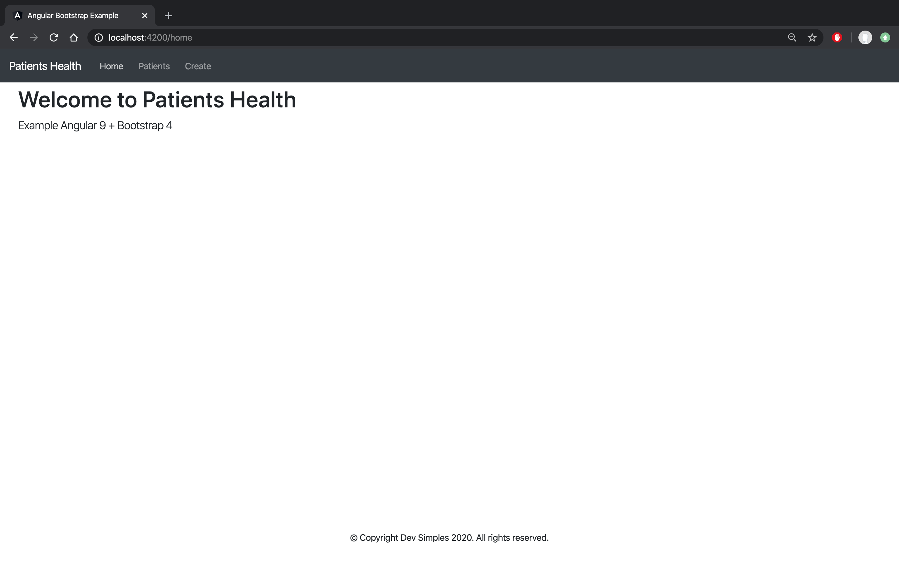
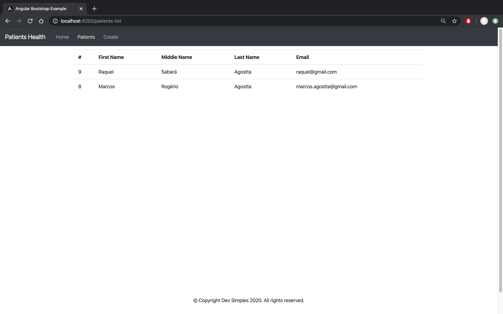
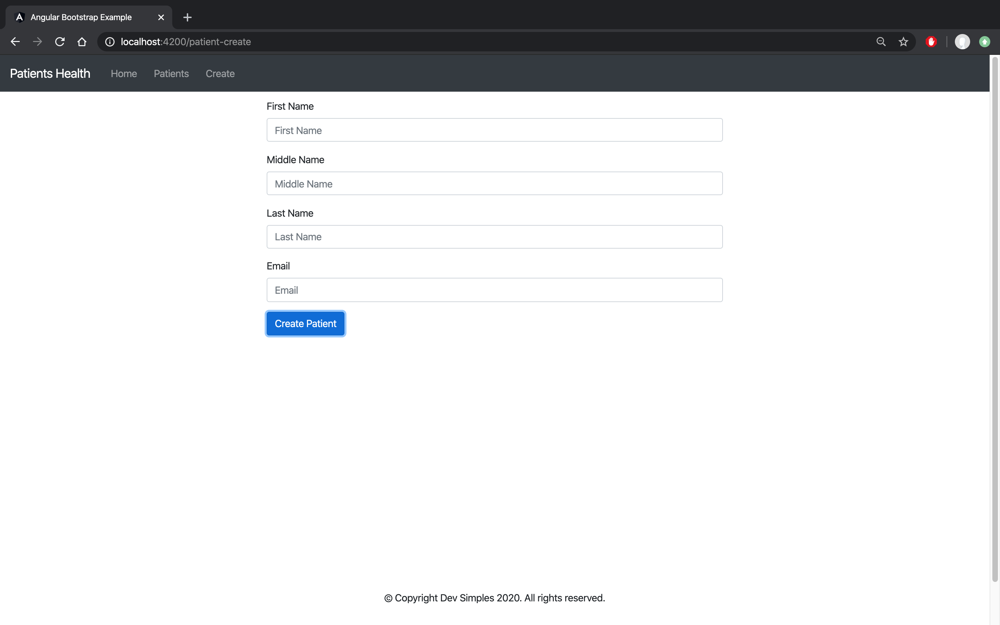

# example-angular
Example using Angular 9 and Bootstrap 4

## Setup
In order to run this example you need to setup [patient-backend.](https://github.com/devsimples/example-spring-boot)

## Prints
### Home

### Patient List

### Patient Create

